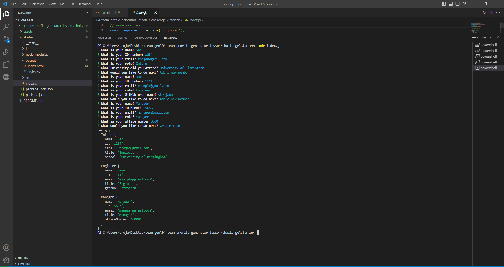
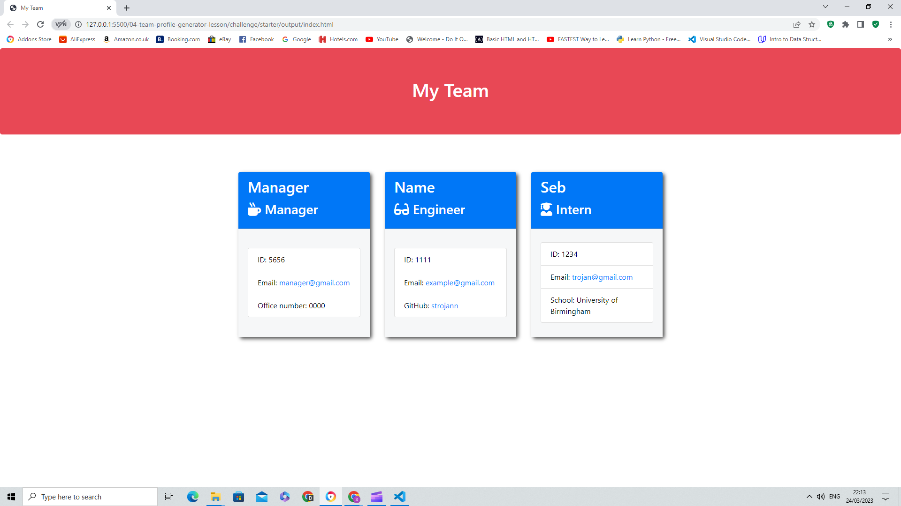

<b>Team-Profile-Generator <b>

This 'Team Profile Generator' is an application which is an example of Object oriented programming and it takes data about people on a software development team, then generates a HTML page that displays information about each person on the team. This works by answering questions about the persons job title, name, id and email.

<b> User Story <b>

I want to generate a page with my groups basic data so that I have rapid access to their basic information such as emails or github profiles.

<b>Install<b>

To have access you need to have this program running and have Node downloaded. Once you have Node ensure you use Jest.

<b>Tech<b>

<li>HTML
 
<li>CSS
 
<li>Npm
 
<li>Node.js

<b>Photos<b>

 

 

